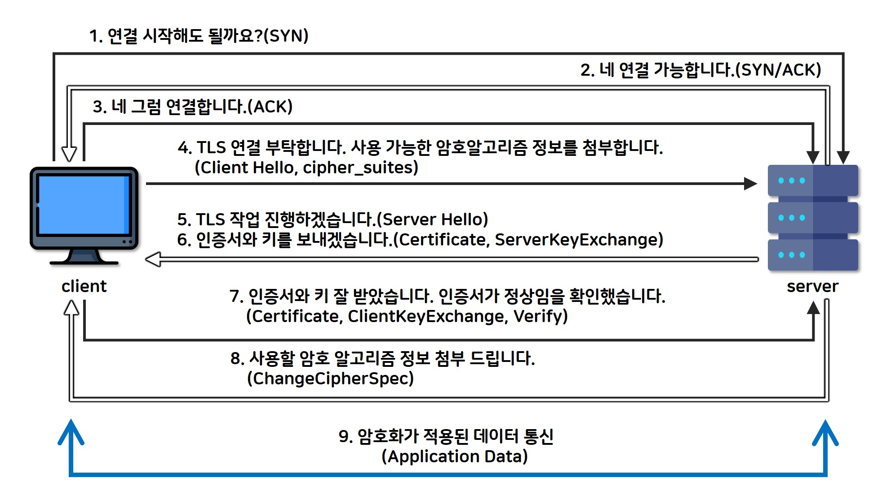
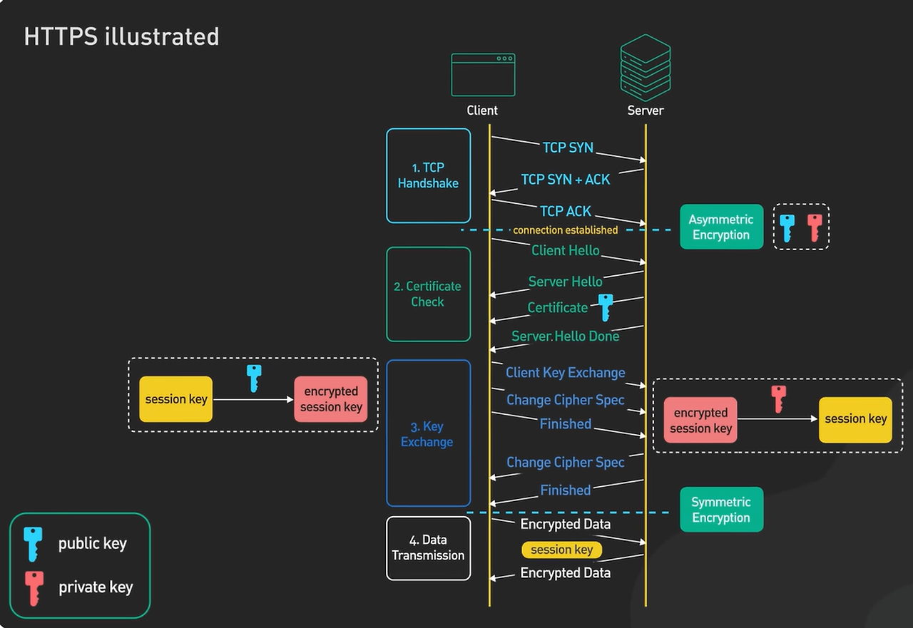
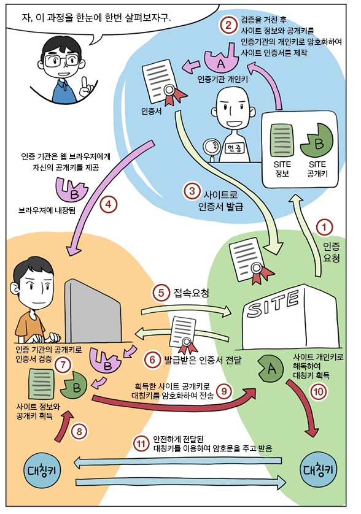

# [NW] HTTPS 동작 원리

> Network에 대해서 공부한 내용을 정리한 글입니다.
> HTTPS가 TLS를 통해 어떻게 요청과 응답을 암호화하는지 다룹니다.


HTTPS는 HTTP의 요청과 응답을 TLS를 사용해서 암호화하는 기술입니다.


## SSL/TLS(Transfer Layer Security)

### 개념

전송 계층의 보안으로 기존 SSL에 기반한 프로토콜입니다.

공개키 암호화 방식을 사용해서 개인키를 주고받지 않고도 양방향 암호화(암호화, 복호화가 둘 다 가능한 암호 방식)을 통해 안전한 통신이 가능하게 합니다.

> 1990에 SSL 2.0의 취약점을 개선한 SSL 3.0이 TLS로 이름이 변경되었고 대부분 TLS로 교체되어 사람들이 SSL/TLS를 혼용해서 사용합니다. (같은 기술의 뿌리를 두고 있다고 생각하면 됩니다.)


TLS를 활용해 암호화하는 과정에서 2가지 장점이 있습니다.

1. 중간에 데이터가 탈취되어도 중간자가 읽을 수 없도록 한다.
2. 개인은 믿을만한 서버와 통신하는지 서버의 **인증서**를 가지고 CA를 통해서 검증할 수 있다.


### 동작 원리

> DH(Diffie-Hellman)/ECDHE 방식으로 세션키를 합의한다.

서버와 클라이언트가 서로 공개값을 교환합니다.
하지만 각자의 비밀값은 절대 보내지 않습니다.

그런데 수학적으로 양쪽은 같은 공유 비밀값을 계산할 수 있습니다.
중간에서 훔쳐본 사람은 공개값만 보고는 그 공유 비밀값을 계산하기 어렵습니다.

> 수학적 원리

```
공개값: p, g

클라이언트 비밀값: a
서버 비밀값: b

클라이언트 공개값: A = g^a mod p
서버 공개값: B = g^b mod p

클라이언트가 계산: B^a mod p = (g^b)^a mod p = g^(ab)
서버가 계산: A^b mod p = (g^a)^b mod p = g^(ab)

B^a = (g^b)^a = g^(ab)
A^b = (g^a)^b = g^(ab)
```

1. 공개된 기준값 `g`와 큰 소수 `p`를 사용해 각자가 자신의 비밀값으로 공개값을 만든다.
2. 상대방의 공개값에 다시 자신의 비밀값을 적용하면 양쪽 모두 같은 공유 비밀값을 얻는 구조입니다.
3. 중간 공격자는 `p`, `g`, `A`, `B`를 볼 수 있지만, `a`, `b`를 모르기 때문에 같은 공유 비밀값을 계산하기 어렵다.

공개값은 `g^개인비밀값 mod p`로 만들고, 공유키는 `상대공개값^내비밀값 mod p`로 만듭니다. 양쪽 결과는 결국 `g^(ab) mod p`로 같아집니다.


### 동작 과정 (TLS Handshake)

데이터를 주고받기 전, 서버의 무결성을 확인하고 키교환을 하는 과정입니다.



참고 - [https://raonctf.com/essential/study/web/ssl_tls](https://raonctf.com/essential/study/web/ssl_tls)


> **PHASE 1 - 연결지향 통신을 위한 [3-HandShake](https://mindnet.tistory.com/entry/%EB%84%A4%ED%8A%B8%EC%9B%8C%ED%81%AC-%EC%89%BD%EA%B2%8C-%EC%9D%B4%ED%95%B4%ED%95%98%EA%B8%B0-22%ED%8E%B8-TCP-3-WayHandshake-4-WayHandshake)을 수행**

1. SSL과 TLS 통신도 여느 통신과 마찬가지로 연결성을 유지하는 통신입니다. 따라서 연결을 먼저 수행합니다.
2. 서버는 연결이 가능한가에 대한 응답을 주게 되는데, 연결 가능 시에만 `SYN/ACK`라는 패킷을 보내게 됩니다.
3. 연결이 가능하다라는 응답을 들었다는 패킷인 `ACK 패킷`을 보내 연결을 완전하게 수행합니다. 이후부터 SSL과 TLS 보안 통신을 위한 암호화 통신 준비과정을 시작하게 됩니다.


> **PHASE 2 - SSL, TLS 암호화 통신 과정**

1. SSL과 TLS는 통신을 수행하기 전에 먼저 암호화를 수행하기 위한 준비를 수행하게 됩니다. 이러한 암호화를 수행하기 위해 각 사용자와 서버는 연결을 수행할 준비를 하고, `암호화를 수행할 알고리즘을 교환`합니다.
2. 사용자는 서버와 암호화 통신을 수행하기 위해, 4번에서와 같이 `자신이 사용할 수 있는 암호 알고리즘 리스트를 전송`합니다. 그렇게 되면 서버에서 암호화에 사용할 알고리즘을 선택할 수 있게 됩니다.
3. 암호화 통신은 중간자 공격이라는 공격을 수행할 수 있습니다. 이러한 공격으로부터 안전하기 위해서는 `제 3자에게 인증받은 인증서를 기반으로 통신`하게 됩니다. 그러므로 5~6번에서는 먼저, 정상적인 서버(인증받은 서버)인지 확인할 수 있는 인증서를 공유합니다.
4. 이후 인증이 정상적으로 완료되었다면, 암호화 통신에 사용할 암호 알고리즘을 최종적으로 교환하게 됩니다.
5. 위의 과정이 모두 정상적으로 완료되었다면, 이후부터는 암호화가 적용된 안전한 데이터 통신이 가능합니다.


### 인증서는 뭘까?

CA(Certification Authorize)는 어떤 도메인과 공개키의 연결 관계를 보증합니다.

즉 CA에게 검증된 인증서는 해당 도메인에 실제로 현재 인증서를 준 서버가 관리/소속 되어 있는지를 보장합니다.

브라우저는 신뢰하는 CA의 공개키를 미리 내장하고 있습니다.
서버가 발급받은 인증서는 CA가 개인키로 암호화 되어 있습니다.
개인(브라우저)는 서버에게 받은 인증서를 통해서 신뢰할 수 있는 인증서인지 판단합니다.

> 서버 인증서 내부가 가지고 있는 정보

- 도메인 정보
- 서버 공개키
- CA 서명
- 유효기간




참고 - [https://dkswhdgur246.tistory.com/54](https://dkswhdgur246.tistory.com/54)


1. 클라이언트가 Client Random을 만들어 서버에 보낸다.
2. 서버가 Server Random을 만들어 클라이언트에 보낸다.
3. 서버는 인증서를 보내고, 인증서 안에는 서버 공개키가 들어 있다.
4. 클라이언트는 인증서를 검증한 뒤, Pre-Master Secret을 만든다.
5. 클라이언트는 Pre-Master Secret을 서버 공개키로 암호화해서 보낸다.
6. 서버는 자신의 개인키로 복호화해서 Pre-Master Secret을 얻는다.
7. 이제 양쪽은 모두 Client Random, Server Random, Pre-Master Secret을 가지고 있다.
8. 양쪽은 같은 PRF 계산으로 Master Secret을 만든다.
9. Master Secret에서 실제 암호화 키, MAC 키, IV 등을 파생한다.
10. 이후 HTTP header/body는 이 대칭키들로 암호화되어 전송된다.


> PRF(Pseudo-Random Function) 즉 의사난수 함수입니다.
> `Pre-Master Secret`, `Client Random`, `Server Random` 같은 재료를 넣으면 예측하기 어려운 키 재료를 뽑아주는 함수입니다.


### 이게 웹에서 어떻게 적용되는가?




## 꼬리 질문

TLS 1.3 차이점 (알면 가산점)

- Handshake가 2-RTT → 1-RTT로 단축
- RSA 키 교환 제거, (EC)DHE만 지원 → Forward Secrecy 보장
- Forward Secrecy: 서버 개인키가 유출돼도 과거 통신은 복호화 불가

"CA가 뭔가요?" → Certificate Authority, 인증서를 발급하는 신뢰된 제3자 (Let's Encrypt, DigiCert 등)

"자체 서명 인증서(Self-signed)는 왜 브라우저가 경고하나요?" → CA 체인으로 검증 불가

"SNI가 뭔가요?" → 한 IP에서 여러 HTTPS 사이트 호스팅 시 어떤 도메인인지 구분

"MITM 공격을 어떻게 막나요?" → 인증서 검증으로 서버의 신원을 보장
