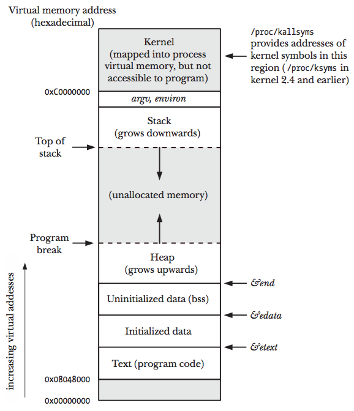
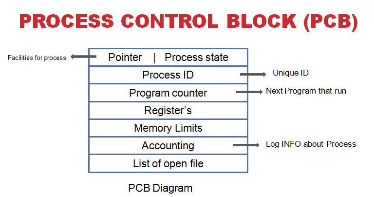
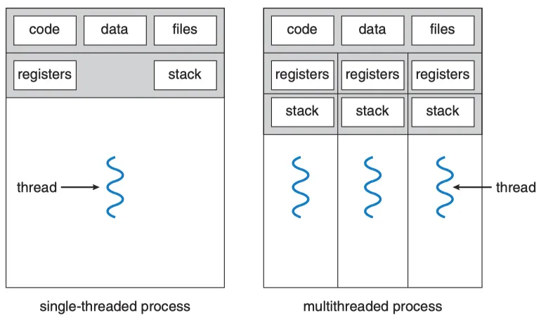

# 프로세스와 스레드

> 운영체제에서 가장 기본이 되는 실행 단위인 프로세스와 스레드를 정리한 글입니다.
> 메모리 구조, PCB, 상태 전이, 컨텍스트 스위칭, IPC, 멀티스레드 모델까지 다룹니다.


## Study 동기

서버 애플리케이션을 운영하다 보면 "왜 멀티스레드로 처리하는가?", "프로세스를 늘려야 하는가, 스레드를 늘려야 하는가?", "컨텍스트 스위칭 비용이 왜 문제가 되는가?" 같은 질문을 자주 마주치게 됩니다.

이 질문에 답하려면 결국 프로세스와 스레드가 메모리에서 어떻게 다루어지고, OS가 이들을 어떻게 스케줄링하는지를 이해해야 합니다. CS 기본기로서 한 번 정리해 둡니다.


## 1. 프로세스(Process)

### 프로그램 vs 프로세스

**프로그램(Program)** 은 보조기억장치(HDD, SSD)에 존재하는 정적인 실행 파일입니다. (`.exe`, `.jar`, ELF 바이너리 등)
파일 자체로는 실행될 수 없으며, OS에 실행 요청이 들어와야만 메모리에 적재되고 CPU가 명령어를 실행합니다.

**프로세스(Process)** 는 이렇게 **메모리에 적재되어 실행 중인 프로그램**입니다.
같은 프로그램이라도 여러 번 실행하면 여러 개의 프로세스가 됩니다. (예: 크롬 창을 두 개 띄우면 PID가 다른 프로세스 두 개)


### 프로그램이 실행되는 과정

1. **프로그램 실행 요청**
   - 사용자가 더블클릭/명령어 입력으로 OS에 실행을 요청합니다.
2. **프로세스 생성 시작**
   - OS가 새로운 PID(Process ID)를 할당합니다.
   - PCB(Process Control Block)를 생성합니다.
3. **메모리에 적재 (Loading)**
   - 디스크의 프로그램을 메모리로 올립니다.
   - Code, Data, Heap, Stack 영역이 구성됩니다.
4. **초기 상태 설정**
   - PC(Program Counter)를 시작 지점으로 설정합니다.
   - 레지스터/스택을 초기화합니다.
5. **Ready 상태**
   - CPU 실행을 기다리는 상태로 전환합니다.
   - 스케줄러가 실행 순서를 결정합니다.
6. **Running 상태**
   - CPU를 할당받아 명령어를 하나씩 실행합니다.


### 프로세스 메모리 구조



| 영역             | 저장 내용                                    | 특징                                            |
| ---------------- | -------------------------------------------- | ----------------------------------------------- |
| **Code (Text)**  | 실행 명령어(기계어)                          | 읽기 전용, 컴파일 타임에 크기 결정              |
| **Data**         | 초기화된 전역/정적 변수                      | 프로그램 시작 시 할당, 종료 시 반환             |
| **BSS**          | 초기화되지 않은 전역/정적 변수               | 0으로 초기화                                    |
| **Heap**         | 동적 할당 객체 (`malloc`, `new`)             | 낮은 주소 → 높은 주소로 증가, 개발자/GC가 관리  |
| **Stack**        | 지역변수, 함수 인자, 리턴 주소               | 높은 주소 → 낮은 주소로 증가, 함수 호출마다 push/pop |

> Heap과 Stack은 서로 마주보며 자라기 때문에, 충돌하면 Stack Overflow / Heap Overflow가 발생합니다.

*프로세스 메모리는 **가상 메모리**를 기반으로 할당됩니다.*

> **가상 메모리란?**
> 실제 물리 메모리보다 더 큰 규모를 활용할 수 있게 해주는 기술입니다.
> 가상 주소를 프로그램에 할당하고 실제 주소로 매핑하며, 매핑 정보는 **페이지 테이블**에 저장됩니다.
> 덕분에 각 프로세스는 서로의 메모리에 접근할 수 없는 **격리(isolation)** 가 보장됩니다.


### PCB (Process Control Block)

PCB는 OS가 프로세스를 관리하기 위해 저장하는 정보의 묶음입니다.
Task Control Block 또는 Job Control Block이라고도 부릅니다.

CPU는 한 번에 하나의 프로세스만 실행할 수 있기 때문에, 여러 프로세스를 동시에 처리하려면 **컨텍스트 스위칭**이 필요합니다. PCB는 이때 "어디까지 실행했었는지"를 복원하기 위한 핵심 자료입니다.



| 항목                    | 설명                                                  |
| ----------------------- | ----------------------------------------------------- |
| PID                     | 프로세스를 구분하는 유니크한 ID                       |
| State                   | New \| Ready \| Running \| Waiting \| Terminated      |
| PC (Program Counter)    | 다음에 실행할 명령어의 주소                           |
| Register                | CPU 레지스터 값 (연산 상태)                           |
| 스케줄링 정보           | 우선순위, 최종 실행 시각, CPU 점유시간                |
| 메모리 관리 정보        | 페이지 테이블, 세그먼트 테이블 베이스 주소            |
| I/O 상태 정보           | 열린 파일 목록, 할당된 I/O 디바이스                   |
| 계정(Accounting) 정보   | CPU 사용량, 실행 시간 한도                            |


### 프로세스 상태 전이

```
   New ──admit──▶ Ready ◀──── interrupt ──── Running ──exit──▶ Terminated
                    │                          │
                    │       scheduler           │
                    └────── dispatch ───────────┘
                                   │
                              I/O 요청 / 이벤트 대기
                                   ▼
                                Waiting
                                   │
                              I/O 완료 / 이벤트 발생
                                   ▼
                                 Ready
```

- **New**: 프로세스 생성 중
- **Ready**: CPU 할당을 기다리는 상태
- **Running**: CPU에서 실행 중
- **Waiting (Blocked)**: I/O 또는 이벤트를 기다리는 상태
- **Terminated**: 실행 종료


### 프로세스의 특징

- 각 프로세스는 **독립된 메모리 공간**(Code, Data, Heap, Stack)을 할당받습니다.
- 한 프로세스는 다른 프로세스의 변수/자료구조에 직접 접근할 수 없습니다. → **안정성↑, 격리성↑**
- 다른 프로세스의 자원에 접근하려면 **IPC(Inter-Process Communication)** 가 필요합니다.
- 프로세스 생성/전환 비용이 비쌉니다. (메모리 공간 통째로 만들고 PCB 교체)


## 2. 스레드(Thread)

### 스레드란?

**스레드는 프로세스 내에서 실행되는 흐름의 단위**입니다.
하나의 프로세스는 최소 하나(메인 스레드) 이상의 스레드를 가지며, 여러 스레드를 가질 수 있습니다.

스레드는 프로세스의 자원을 공유하면서, 자신만의 실행 흐름을 갖습니다.



### 스레드가 공유하는 것 / 갖는 것

| 공유 (프로세스 단위)        | 개별 보유 (스레드 단위)         |
| --------------------------- | ------------------------------- |
| Code 영역                   | Stack                           |
| Data 영역 (전역/정적 변수)  | Register 값                     |
| Heap 영역                   | PC (Program Counter)            |
| 파일 디스크립터, 시그널 핸들러 | TCB (Thread Control Block)    |

> Heap을 공유하기 때문에 스레드 간 **데이터 공유는 빠르지만**, 동시에 같은 자원에 접근하면 **race condition**이 발생할 수 있습니다. → 동기화(Lock, Mutex, Semaphore) 필요.


### 스레드의 장점

- **응답성 향상**: UI 스레드가 멈추지 않고 백그라운드에서 작업 가능
- **자원 공유**: Heap을 공유하므로 IPC 없이 데이터 교환 가능
- **경제성**: 프로세스 생성보다 스레드 생성 비용이 훨씬 저렴
- **멀티코어 활용**: 여러 코어에 스레드를 분산해 병렬 처리 가능


### 스레드의 단점

- **동기화 문제**: 공유 자원 접근 시 race condition 발생 가능
- **디버깅 어려움**: 비결정적(non-deterministic) 실행 순서
- **하나가 죽으면 같이 죽음**: 한 스레드가 비정상 종료되면 프로세스 전체가 영향받을 수 있음


## 3. 컨텍스트 스위칭(Context Switching)

CPU가 현재 실행 중인 프로세스/스레드를 멈추고 다른 것으로 전환하는 과정입니다.

### 동작 순서

1. 현재 실행 중인 프로세스의 상태(레지스터, PC 등)를 PCB에 저장
2. 다음 실행할 프로세스의 PCB에서 상태를 복원
3. 복원된 PC가 가리키는 위치부터 실행 재개

### 발생 시점

- **타임 슬라이스 만료**: 스케줄러가 시간 할당량을 다 쓴 프로세스를 교체
- **I/O 요청**: 프로세스가 Waiting 상태로 전환
- **인터럽트**: 하드웨어 인터럽트 발생
- **우선순위 선점**: 더 높은 우선순위 프로세스가 등장

### 비용

컨텍스트 스위칭은 **순수 오버헤드**입니다. 사용자 코드는 진행되지 않지만 다음 작업이 수행됩니다.

- PCB save/restore 비용
- **캐시(L1/L2/TLB) 무효화** → cold cache로 시작 → 성능 저하
- 프로세스 간 스위칭은 페이지 테이블까지 교체하므로 **스레드 간 스위칭보다 비쌉니다**


## 4. 멀티프로세스 vs 멀티스레드

| 비교 항목         | 멀티프로세스                        | 멀티스레드                            |
| ----------------- | ----------------------------------- | ------------------------------------- |
| 메모리            | 각자 독립된 공간                    | Heap/Data 공유                        |
| 통신              | IPC 필요 (느림)                     | 공유 메모리 (빠름)                    |
| 안정성            | 한 프로세스가 죽어도 다른 프로세스 영향 X | 한 스레드 문제로 프로세스 전체 영향 |
| 생성/전환 비용    | 높음                                | 낮음                                  |
| 동기화            | 거의 불필요                         | 반드시 필요 (Lock, Mutex 등)          |
| 사용 예           | Chrome 탭별 프로세스, Nginx worker  | 웹 서버 요청 처리, 게임 엔진          |

**선택 기준**

- **안정성/격리** 가 중요하면 → 멀티프로세스 (브라우저, DB)
- **빠른 데이터 공유와 자원 효율** 이 중요하면 → 멀티스레드 (서버, 게임)


### 트레이드오프 정리

| 관점        | 멀티프로세스          | 멀티스레드            |
| ----------- | --------------------- | --------------------- |
| 메모리 사용 | 많음 (코드/데이터 복제) | 적음 (Heap 공유)      |
| 데이터 공유 | IPC 필요, 느림        | 직접 접근, 빠름       |
| 안정성      | 한 쪽 크래시가 전파 안 됨 | 한 스레드 오류로 전체 종료 |
| 생성/전환 비용 | 높음 (페이지 테이블 교체) | 낮음 (Stack만 교체)   |
| 동기화      | 거의 불필요           | Lock/Mutex 필수       |
| 보안        | OS 수준 메모리 격리   | 같은 메모리 공유로 취약 |
| 디버깅      | 로그 추적 분산        | 비결정적 실행으로 어려움 |
| 확장성      | 멀티 머신으로 확장 용이 | 단일 머신 코어 활용에 최적 |

**핵심 원리**

> 결국 **"격리에 비용을 지불할 것인가, 공유에 위험을 감수할 것인가"** 의 선택입니다.

- **프로세스**: 메모리·통신 비용을 지불하고 안정성·보안을 얻는다.
- **스레드**: 동기화·장애 전파의 위험을 감수하고 속도·효율을 얻는다.

실무에서는 두 방식을 섞어 씁니다. (예: Nginx는 멀티프로세스 워커 + 워커 내부 이벤트 루프, JVM은 단일 프로세스 + 멀티스레드)


## 5. IPC (Inter-Process Communication)

프로세스는 격리되어 있기 때문에, 서로 데이터를 주고받으려면 OS가 제공하는 IPC 메커니즘이 필요합니다.


| 방식                   | 설명                                                | 특징                       |
| ---------------------- | --------------------------------------------------- | -------------------------- |
| **Pipe**               | 부모-자식 간 단방향 통신 채널                       | 간단, 같은 호스트          |
| **Named Pipe (FIFO)**  | 이름을 가진 파이프, 무관한 프로세스 간 통신 가능    | 단방향, 영구적             |
| **Message Queue**      | 메시지 단위로 큐에 저장/조회                        | 비동기, 메시지 경계 보존   |
| **Shared Memory**      | 같은 물리 메모리를 여러 프로세스가 매핑             | **가장 빠름**, 동기화 필요 |
| **Semaphore**          | 공유 자원 접근 제어용 카운터                        | 주로 동기화 용도           |
| **Socket**             | 네트워크 또는 로컬(Unix domain) 통신                | 호스트 간 통신 가능        |
| **Signal**             | 비동기 알림 (SIGINT, SIGTERM 등)                    | 간단한 이벤트 전달         |

> Shared Memory는 빠르지만 race condition을 막기 위해 별도의 동기화(Semaphore, Mutex)가 필요합니다.


## 6. 정리

- **프로세스** = 실행 중인 프로그램 + 독립된 메모리 + PCB
- **스레드** = 프로세스 내 실행 흐름 + Stack/Register 개별 보유 + Code/Data/Heap 공유
- **PCB**는 컨텍스트 스위칭 시 프로세스 상태를 저장/복원하는 핵심 자료구조
- **컨텍스트 스위칭은 비용이 있다** → 너무 많은 스레드/프로세스는 오히려 성능 저하
- **멀티프로세스**는 안정성, **멀티스레드**는 효율이 강점
- 프로세스 간 데이터를 주고받으려면 **IPC**가 필요

서버 애플리케이션을 설계할 때 "Thread Pool 크기를 얼마로 할까?", "프로세스를 fork해서 띄울까, 스레드 풀로 처리할까?" 같은 질문은 결국 위 개념들의 트레이드오프 위에서 결정됩니다.


## 7. 실전 예시

### 멀티프로세스가 적합한 작업 — 웹 브라우저의 탭 처리 (Chrome)

크롬은 **탭마다 별도의 프로세스**를 띄웁니다.

```
[Browser Process]
  ├── [Tab Process] naver.com         ← 메모리 공간 A
  ├── [Tab Process] youtube.com       ← 메모리 공간 B
  ├── [Tab Process] github.com        ← 메모리 공간 C  (← 여기서 크래시!)
  └── [GPU Process], [Network Process], ...
```

**왜 멀티프로세스가 적합한가?**

1. **장애 격리(Fault Isolation)가 최우선**
   유튜브 탭에서 JS 무한 루프나 메모리 누수가 발생해도, 같은 메모리 공간을 공유하지 않으므로 다른 탭은 멀쩡합니다. 멀티스레드였다면 한 탭의 크래시가 브라우저 전체를 죽일 수 있습니다.

2. **보안 샌드박싱(Sandboxing)**
   각 탭은 독립된 주소 공간에 있어, 악성 사이트의 JS가 다른 탭의 쿠키/세션 메모리를 직접 읽을 수 없습니다. OS 수준의 메모리 격리가 보안 경계 역할을 합니다.
   → 만약 스레드로 구현했다면, 같은 Heap을 공유하므로 메모리 취약점 하나가 모든 탭의 정보를 노출시킬 수 있습니다.

3. **탭 간 데이터 공유가 거의 없다**
   탭들은 각자 독립적인 페이지를 보여주는 것이 본질입니다. IPC 비용이 발생할 일이 적기 때문에 프로세스 격리의 단점(통신 비용)이 크게 부각되지 않습니다.

4. **트레이드오프 수용 가능**
   메모리를 더 쓰는 단점이 있지만, "탭 하나 죽으면 전부 죽는다"는 경험이 훨씬 더 치명적이기 때문에 메모리를 더 쓰는 쪽을 선택한 것입니다.

→ **데이터 공유가 거의 없고, 격리/안정성/보안이 핵심 가치**일 때 멀티프로세스가 정답입니다.


### 멀티스레드가 적합한 작업 — 웹 서버의 요청 처리 (Spring Boot Tomcat)

Tomcat은 **하나의 프로세스 안에서 스레드 풀로 동시 요청**을 처리합니다.

```
[Tomcat Process]
  Code, Data, Heap (공유) — DB Connection Pool, Cache, Session Store
  │
  ├── Thread #1  ◀── 요청 A 처리 중 (DB I/O 대기)
  ├── Thread #2  ◀── 요청 B 처리 중 (계산)
  ├── Thread #3  ◀── 요청 C 처리 중 (외부 API 호출)
  └── ... (max=200)
```

**왜 멀티스레드가 적합한가?**

1. **공유 자원이 핵심이다**
   모든 요청은 동일한 **DB 커넥션 풀, 캐시, 세션 저장소, 설정값**을 사용합니다.
   - 스레드라면 → Heap에 한 번만 만들고 모든 스레드가 즉시 접근.
   - 프로세스라면 → 프로세스마다 커넥션 풀을 따로 만들어야 하고(메모리 낭비), 캐시도 동기화하려면 IPC나 Redis 같은 외부 저장소가 필요해집니다.

2. **요청 처리는 대부분 I/O-bound**
   요청 한 건은 보통 "DB 100ms 대기 + 코드 5ms" 같은 패턴입니다. 스레드가 I/O를 기다리는 동안 OS는 다른 스레드에 CPU를 줄 수 있어, **8코어 서버에서 200개 요청을 동시에 처리**하는 것이 가능합니다. (블로킹 I/O 모델 기준)

3. **생성/전환 비용이 저렴**
   요청은 초당 수백~수천 건씩 들어옵니다. 매번 프로세스를 fork했다면 (메모리 전체 복사 + PCB 생성) 비용을 감당할 수 없습니다. 스레드는 Stack과 Register만 새로 만들면 되므로 훨씬 가볍습니다.

4. **요청 간 격리는 코드 레벨로 충분**
   각 요청은 자기만의 Stack(지역변수)을 가지므로, 비즈니스 로직이 동기화만 잘 지키면 데이터 충돌이 발생하지 않습니다. OS 수준의 메모리 격리까지는 과합니다.

→ **공유 자원에 대한 빠른 접근이 필요하고, I/O 대기가 많으며, 동시성 단위가 매우 많이/자주 생성/소멸**될 때 멀티스레드가 정답입니다.


### 한 줄 비교

|                | Chrome (멀티프로세스)                | Tomcat (멀티스레드)                  |
| -------------- | ------------------------------------ | ------------------------------------ |
| 동시성 단위    | 탭 (수십 개, 수 분~시간 유지)        | 요청 (초당 수백~수천, 짧게 끝남)     |
| 공유 데이터    | 거의 없음                            | DB 풀, 캐시 등 매우 많음             |
| 한 단위 크래시 시 | 다른 단위는 살아남아야 함           | 요청 하나 실패는 코드 레벨 처리로 충분 |
| 핵심 가치      | **격리, 안정성, 보안**               | **자원 공유, 처리량, 효율**          |
